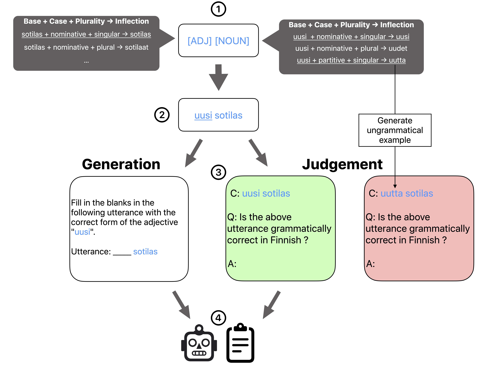

# [IMPACT: Inflectional Morphology Probes Across Complex Typologies](https://arxiv.org/abs/2506.23929)



This repository provides a framework for probing LLMs on morphologically-rich languages using inflectional morphology as the core evaluation lens. It supports flexible data generation via templates and modular model inference with Hydra.

---
## ⚙️ Installation

We recommend using [`uv`](https://github.com/astral-sh/uv) for dependency management:

```bash
uv venv
uv pip install -r requirements.txt
```

Then, set up your environment variables in a `.env` file:

```env
GCP_PROJECT_ID=""
vLLM_TOKEN=""
```

---

## 🧪 Data Generation

To obtain the generated data, please unzip the file `data/generated.zip`.

### Generate All Templates & Scenarios

To generate data for all registered templates and both `generation` and `judge` scenarios:

```bash
uv run scripts/generate_data.py --all_templates \
                                --all_scenarios \
                                --sample \
                                --sample_n 50 \
                                --verbose
```

This will:
- Generate data for every template in [`TEMPLATE_REGISTRY`](src/templates/__init__.py) for both scenarios
- Sample `sample_n` examples per feature combination
- Save the data under `data/generated`
- Export a CSV file for quick inspection

### Generate a Specific Template + Scenario

```bash
uv run scripts/generate_data.py --template AraVerbGenderPluralityAgreementImperative \
                                --scenario generation \
                                --sample \
                                --sample_n 50 \
                                --verbose
```

### Generate for a Specific Language

To generate data for a specific langauge, you need to pass the language code:

```bash
uv run scripts/generate_data.py --lang_code ara \
                                --all_scenarios \
                                --sample \
                                --sample_n 50 \
                                --verbose
```

### 🔧 Other Optional Arguments

- `--additional_instruction`: Additional instruction appended to the user prompt.
- `--output_dir`: Directory to save generated data (default: `data/generated`).
- `sample_n`: The number of datapoints to sample per feature combination.
- `--sample_output_dir`: Output directory for sampled data (defaults to `output_dir`).
- `--no_csv`: Skip generating the CSV verification file.

🧠 Template logic is implemented under [`src/templates`](src/templates), and placeholder values used in generation are located in [`data/placeholders`](data/placeholders).

---

## 🤖 Model Inference

Run inference over all the most recently generated files for a specific scenario:

```bash
uv run scripts/run_inference.py --all --scenario generaton
```

### Run by Language

```bash
uv run scripts/run_inference.py --lang_code ara --scenario judge
```

### Run on one file

```bash
uv run scripts/run_inference.py --file path/to/sampled_data.json
```

### Run with Custom Hydra Config Overrides

We use [Hydra](https://hydra.cc) for flexible configuration. You can override any model or system instruction parameters:

```bash
uv run scripts/run_inference.py --all \
                                --scenario judge \
                                model=gemini-2.0-flash \
                                model.temperature=1 \
                                system_method=cot
```

🧹 Hydra configs:
- Base config: [`src/inference/config/config.yaml`](src/inference/config/config.yaml)
- Model configs: [`src/inference/config/model`](src/inference/config/model)
- System instructions: [`src/inference/config/system_instructions`](src/inference/config/system_instructions)

### Run in Thinking Mode
```bash
uv run scripts/run_inference.py  --lang_code ara --scenario generation system_method=think model=qwen-3-32B-think
uv run scripts/run_inference.py  --lang_code ara --scenario judge system_method=think model=qwen-3-32B-think
```

### Run for All Models
```bash
zsh scripts/run_models.zsh
```

### Run Qwen3 Thinking Mode
```bash
zsh scripts/run_models_think.zsh
```

### Result Analysis
Run the notebook `scripts/results.ipynb`.

---

## 📁 Project Structure

```
├── data/
│   ├── generated/                      # Generated data
│   ├── placeholders/                   # Placeholder data
│   ├── results/                        # Results data
│   └── templates/                      # Templates data
├── scripts/
│   ├── generate_data.py                # Entry point for data generation
│   ├── results.ipynb                   # Results Notebook
│   ├── run_inference.py                # Entry point for inference
│   ├── run_models.zsh                  # Script to run all models
│   ├── run_models_think.zsh            # Script to run thinking mode
│   └── sample_data_by_features.py      # Entry point for data sampling
└── src/
│   ├── inference/                      # Inference logic & configs
│   ├── templates/                      # Data generation templates
│   └── utils/                          # Helper functions
├── README.md
└── requirements.txt
```

## 📝 Citation
```
@misc{saeed2025impactinflectionalmorphologyprobes,
      title={IMPACT: Inflectional Morphology Probes Across Complex Typologies}, 
      author={Mohammed J. Saeed and Tommi Vehvilainen and Evgeny Fedoseev and Sevil Caliskan and Tatiana Vodolazova},
      year={2025},
      eprint={2506.23929},
      archivePrefix={arXiv},
      primaryClass={cs.CL},
      url={https://arxiv.org/abs/2506.23929}, 
}
```
